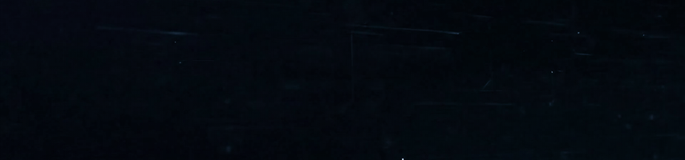

  

<h1 align="center">
  
</h1>

  <samp>
    🚀 Building scalable web apps • 🔥 Cracking DSA • 🤖 Exploring ML • ☕ Turning coffee into clean code!
  </samp>

---

 

  
  ### 🧠 What I Do
  
  <kbd>
    <samp>
      Full-Stack Dev • System Design • Open Source • Code that scales
    </samp>
  </kbd>
  
    
  
  ### 🛠️ My Arsenal
  
  
   
  
   
  
  

---

 

  
  ### 📈 GitHub Pulse
  
  

    
    
    
  

  
   
  
  
  

---

 

  
  ### 🌐 Let’s Build Together
  
  
  
  
  
  

 

  
    
  <kbd>
    <samp>“Eat. Sleep. Code. Repeat.”</samp>
  </kbd>

